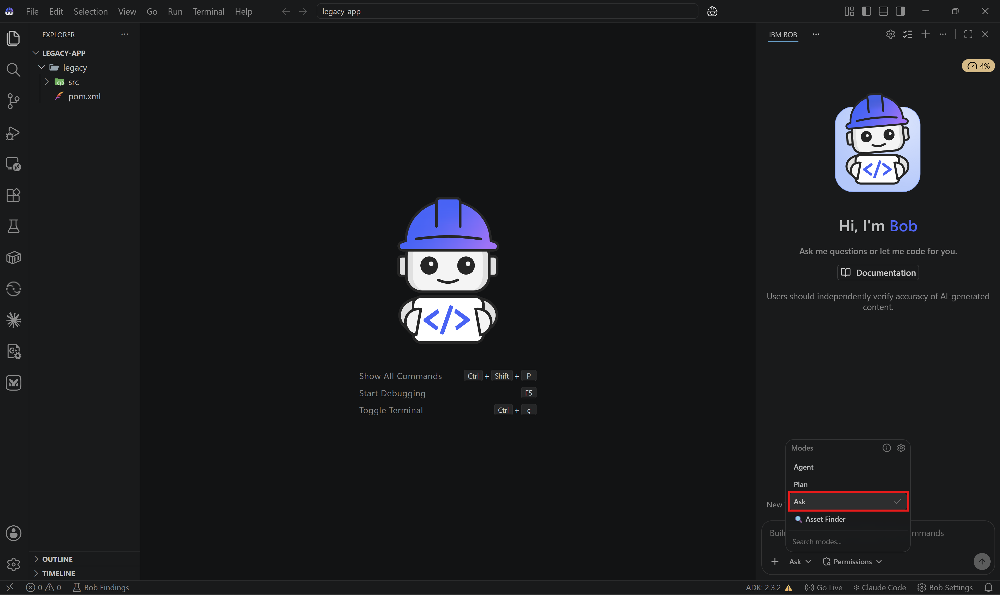
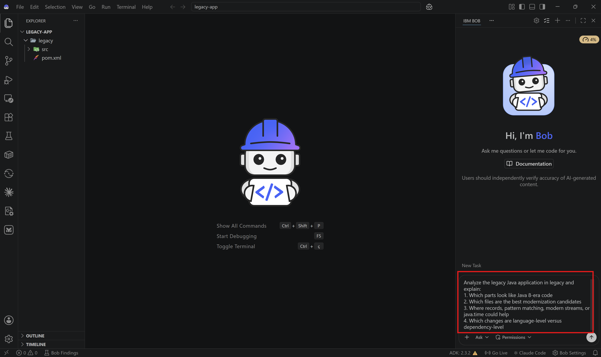
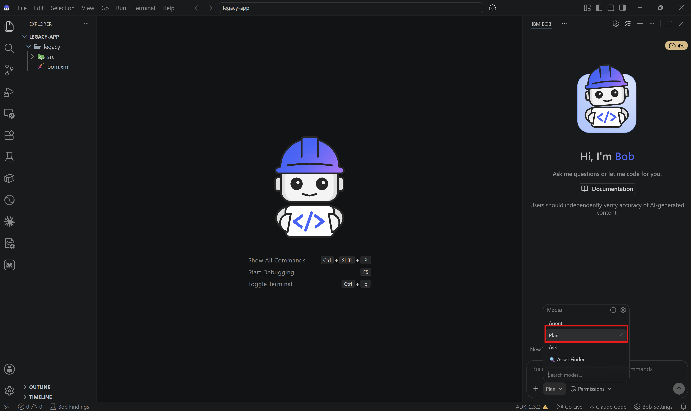
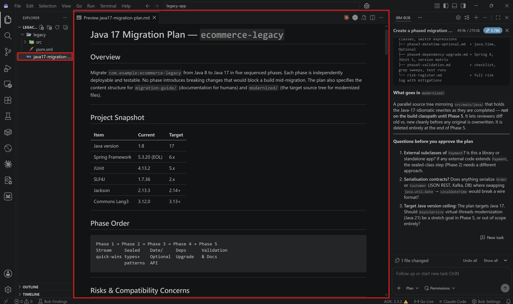

<div class="lab-lock-overlay" id="lock-lab5">
  <div class="lock-content">
    <span class="lock-icon">🔒</span>
    <h2>This lab is locked</h2>
    <p>Complete the quiz at the end of the previous lab to unlock this content.</p>
    <button class="lock-back-btn" onclick="goBackFromLock()">← Go Back</button>
  </div>
</div>

# Lab 5: Java Application Modernization with Bob

## Overview

In this lab, you'll use Bob to modernize a legacy Java application by analyzing an older codebase, defining a migration plan, and applying targeted upgrades toward Java 17.

This lab is intentionally more advanced than the previous Bob labs. The goal is not only to refactor code, but to practice how Bob can support a phased modernization workflow across architecture, language features, and dependencies.

## Before Starting

Make sure you have:
- IBM Bob access
- A JDK for Java 17
- Maven
- A terminal
- A local workspace where Bob can create files and run commands

## What You'll Modernize

This lab uses the legacy Java project in `legacy/` as the starting point.

You will use Bob to:
- Analyze Java 8-style code
- Identify modernization opportunities
- Generate migration notes and planning artifacts
- Create a modernized target structure
- Upgrade language and API usage

## What You'll Learn

By the end of this lab, you will:
- ✅ Use Bob to inspect a legacy Java codebase
- ✅ Create a phased migration plan
- ✅ Modernize domain models and business logic
- ✅ Update dependencies and build configuration
- ✅ Validate a migration path toward Java 17

## Lab Structure

- [Review the legacy application](#step-1-review-the-legacy-application)
- [Create a migration plan](#step-2-create-a-migration-plan)
- [Modernize domain models](#step-3-modernize-domain-models)
- [Modernize business logic and APIs](#step-4-modernize-business-logic-and-apis)
- [Update build configuration and dependencies](#step-5-update-build-configuration-and-dependencies)
- [Validate the migration](#step-6-validate-the-migration)

---

## Step 1: Review the legacy application

### 1.1: Download and open the lab folder in Bob

Download the legacy application ZIP file [here](assets/lab5/legacy-app.zip). Extract it to a new local folder and open the extracted project in IBM Bob before starting the lab.


The sample includes models and services such as:
- `legacy/src/main/java/com/example/ecommerce/model/Product.java`
- `legacy/src/main/java/com/example/ecommerce/model/Order.java`
- `legacy/src/main/java/com/example/ecommerce/service/PaymentService.java`
- `legacy/src/main/java/com/example/ecommerce/service/OrderService.java`
- `legacy/pom.xml`

**✅ Checkpoint**: The legacy Java project is open in your workspace.

### 1.2: Switch to Ask Mode

Change to **Ask Mode**.



### 1.3: Ask Bob for a modernization assessment

Ask Bob:

```text
Analyze the legacy Java application in legacy and explain:
1. Which parts look like Java 8-era code
2. Which files are the best modernization candidates
3. Where records, pattern matching, modern streams, or java.time could help
4. Which changes are language-level versus dependency-level
```



**✅ Checkpoint**: You understand the main modernization opportunities.

---

## Step 2: Create a migration plan

### 2.1: Switch to Plan Mode

Change to **Plan Mode**.



### 2.2: Ask Bob to create the migration structure

Ask Bob:

```text
Create a phased migration plan for upgrading legacy toward Java 17.
Include:
1. A recommended phase order
2. Risks and compatibility concerns
3. Files that should be modernized first
4. What should go into migration-guide/
5. What should go into a future modernized/ target folder
```

Bob may recommend creating folders such as:
- `modernized/`
- `migration-guide/`

That is expected. These folders are part of the modernization workflow and do not need to exist before the lab begins.



**✅ Checkpoint**: You have a structured migration plan before editing code.

---

## Step 3: Modernize domain models

### 3.1: Switch to Agent Mode

Change to **Agent Mode**.

### 3.2: Convert a model to a record

Let's start with `Product.java`.

Ask Bob:

```text
Modernize Product.java for Java 17.
Convert it to a record where appropriate, preserve validation, and write the updated file into a modernized/ target structure.
```

Bob should explain whether a record is appropriate and create the target file accordingly.

**✅ Checkpoint**: You have completed one focused domain-model modernization.

### 3.3: Review other model candidates

Ask Bob:

```text
Review the remaining model classes and recommend which ones are good candidates for records, sealed hierarchies, or other Java 17 features.
```

This is a good point to decide whether `Payment` and related types should become a sealed hierarchy.

**✅ Checkpoint**: You know which model changes are worth applying next.

---

## Step 4: Modernize business logic and APIs

### 4.1: Improve conditional logic

Let's now focus on `PaymentService.java`.

Ask Bob:

```text
Modernize the conditional logic in PaymentService.java.
Use Java 17 features where appropriate, such as pattern matching or switch expressions, while keeping the behavior the same.
```


### 4.2: Improve collection and stream usage

We can also explore implementing changes in the `OrderService.java`.

Ask Bob:

```text
Modernize the collection and stream usage in OrderService.java.
Prefer Java 17-friendly patterns and simplify the code where possible.
```

### 4.3: Review API-level modernization

Ask Bob:

```text
Identify opportunities in the legacy codebase to replace older APIs with modern alternatives, especially Date/Calendar usage, null-heavy patterns, and older collection idioms.
```

**✅ Checkpoint**: You have started modernizing business logic, not just models.

---

## Step 5: Update build configuration and dependencies

### 5.1: Modernize the Maven configuration

Ask Bob:

```text
Create an updated Maven configuration for Java 17 based on legacy/pom.xml.
Update compiler settings and identify dependencies that should be reviewed or upgraded.
Write the updated file into the modernized/ target structure.
```

### 5.2: Ask for a compatibility review

Switch to **Plan Mode** and ask:

```text
Analyze the Java dependency and build upgrade risks for this migration.
Call out anything that could block a move from Java 8 to Java 17.
```

This helps you separate easy source refactors from ecosystem-level risks.

**✅ Checkpoint**: You have both a code plan and a build/dependency plan.

---

## Step 6: Validate the migration

### 6.1: Ask Bob to summarize the migration outcome

Ask Bob:

```text
Summarize the migration changes completed so far, the remaining risks, and the next best steps to finish the Java 17 modernization.
```

### 6.2: Run validation commands

If your environment is ready, ask Bob to run the relevant build or test commands for the migrated target structure.

Switch to **Advanced Mode** and ask:

```bash
Please run the relevant build or test commands for the migrated target structure.
```

**✅ Checkpoint**: You have validated the migration path and captured the remaining work.

---

## Congratulations 🎉 You've completed Lab 5!

You've successfully used Bob to:
- ✅ Assess a legacy Java codebase
- ✅ Plan a phased modernization
- ✅ Apply targeted Java 17-style improvements
- ✅ Review migration risks across both code and dependencies

---

## 🎓 Lab Quiz — Complete the Workshop

<div class="lab-quiz" id="quiz-lab5" data-final="true">

  <!-- Question 1 -->
  <div class="quiz-question" data-correct="B">
    <p><strong>Question 1:</strong> In Lab 5, which of the following is NOT listed as something Bob is asked to identify during the modernization assessment?</p>
    <label><input type="radio" name="q1-lab5" value="A"> A) Which parts look like Java 8-era code</label><br>
    <label><input type="radio" name="q1-lab5" value="B"> B) Which unit tests need to be rewritten for Java 17</label><br>
    <label><input type="radio" name="q1-lab5" value="C"> C) Which files are the best modernization candidates</label><br>
    <label><input type="radio" name="q1-lab5" value="D"> D) Which changes are language-level versus dependency-level</label>
    <div class="quiz-feedback" hidden></div>
  </div>

  <!-- Question 2 -->
  <div class="quiz-question" data-correct="C">
    <p><strong>Question 2:</strong> In Lab 5, what Java feature does Bob use when modernizing Product.java?</p>
    <label><input type="radio" name="q2-lab5" value="A"> A) Abstract class</label><br>
    <label><input type="radio" name="q2-lab5" value="B"> B) Generic interface</label><br>
    <label><input type="radio" name="q2-lab5" value="C"> C) Java record</label><br>
    <label><input type="radio" name="q2-lab5" value="D"> D) Enum type</label>
    <div class="quiz-feedback" hidden></div>
  </div>

  <!-- Question 3 -->
  <div class="quiz-question" data-correct="A">
    <p><strong>Question 3:</strong> According to Lab 5, which two folders does Bob recommend creating as part of the modernization workflow?</p>
    <label><input type="radio" name="q3-lab5" value="A"> A) modernized/ and migration-guide/</label><br>
    <label><input type="radio" name="q3-lab5" value="B"> B) tests/ and docs/</label><br>
    <label><input type="radio" name="q3-lab5" value="C"> C) backup/ and archive/</label><br>
    <label><input type="radio" name="q3-lab5" value="D"> D) legacy/ and updated/</label>
    <div class="quiz-feedback" hidden></div>
  </div>

  <button class="quiz-submit-btn" onclick="submitQuiz('lab5')">Submit Answers</button>
  <div class="quiz-result" hidden></div>

</div>

<!-- Congratulations modal (hidden until Lab 5 quiz is submitted) -->
<div class="congrats-modal" id="congrats-modal" hidden>
  <div class="congrats-content">
    <span class="congrats-icon">🎉</span>
    <h2>Congratulations!</h2>
    <p>You completed all the Labs!</p>
    <button onclick="document.getElementById('congrats-modal').hidden=true">Close</button>
  </div>
</div>
