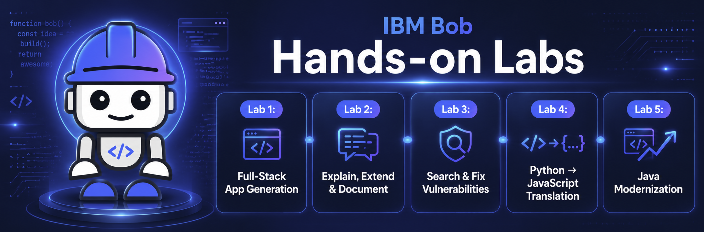

# MkDocs Implementation Plan — IBM Bob Workshop

## Overview

This document describes the complete plan to implement a MkDocs-based static site for the IBM Bob Workshop hands-on labs. The site maps directly onto the existing `bob-workshop-main/` folder structure, adds download hyperlinks for ZIP assets in the relevant labs, and introduces a JavaScript-powered quiz-and-lock mechanism so participants must attempt a short quiz at the end of each lab before the next one is accessible.

---

## 1. Repository Structure

```
bob-workshop-main/            ← existing source folder (kept as-is)
mkdocs.yml                    ← MkDocs configuration file (new)
docs/                         ← MkDocs content root (new)
  index.md                    ← Home page (mirrors bob-workshop-main/README.md)
  lab1.md                     ← Lab 1 content + end-of-lab quiz → unlocks Lab 2
  lab2.md                     ← Lab 2 content + end-of-lab quiz → unlocks Lab 3
  lab3.md                     ← Lab 3 content + end-of-lab quiz → unlocks Lab 4
  lab4.md                     ← Lab 4 content + end-of-lab quiz → unlocks Lab 5
  lab5.md                     ← Lab 5 content + end-of-lab quiz → shows Congratulations modal
  assets/
    banner_intro.png          ← copied from bob-workshop-main/banner_intro.png
    lab1/images/              ← copied from bob-workshop-main/lab1/images/
    lab2/images/              ← copied from bob-workshop-main/lab2/images/
    lab2/application.zip      ← copied from bob-workshop-main/lab2/application.zip
    lab3/images/              ← copied from bob-workshop-main/lab3/images/
    lab3/vulnerable-app.zip   ← copied from bob-workshop-main/lab3/vulnerable-app.zip
    lab4/images/              ← copied from bob-workshop-main/lab4/images/
    lab4/source.zip           ← copied from bob-workshop-main/lab4/source.zip
    lab5/images/              ← copied from bob-workshop-main/lab5/images/
    lab5/legacy-app.zip       ← copied from bob-workshop-main/lab5/legacy-app.zip
  javascripts/
    quiz.js                   ← quiz engine + lab unlock logic (new)
  stylesheets/
    extra.css                 ← padlock styling + quiz styling (new)
```

> **Note**: MkDocs requires all content to live under `docs/`. Binary assets (images, ZIPs) are placed under `docs/assets/` so MkDocs copies them to the output site and relative links work correctly.

---

## 2. Tool & Theme Selection

| Item | Choice | Reason |
|---|---|---|
| MkDocs version | ≥ 1.5 | Current stable |
| Theme | **Material for MkDocs** (`mkdocs-material`) | Rich navigation, custom JavaScript hooks, admonition support |
| Extra plugins | `mkdocs-glightbox` (optional) | Lightbox for screenshots |

Install:
```bash
pip install mkdocs mkdocs-material
```

---

## 3. `mkdocs.yml` Configuration

```yaml
site_name: IBM Bob Workshop
site_description: Hands-on Labs for IBM Bob
docs_dir: docs
theme:
  name: material
  palette:
    primary: blue
    accent: light blue
  features:
    - navigation.tabs
    - navigation.top
    - content.code.copy

extra_css:
  - stylesheets/extra.css

extra_javascript:
  - javascripts/quiz.js

nav:
  - Home: index.md
  - "Lab 1 — Generate a Full-Stack Application": lab1.md
  - "Lab 2 — Explain, Extend and Document": lab2.md
  - "Lab 3 — Search and Fix Vulnerabilities": lab3.md
  - "Lab 4 — Translate Code Python → JavaScript": lab4.md
  - "Lab 5 — Modernize Legacy Java Code": lab5.md
```

---

## 4. Page Content Mapping

### 4.1 `docs/index.md` — Home Page

Mirrors `bob-workshop-main/README.md` verbatim.  
Replace the relative image path `banner_intro.png` → `assets/banner_intro.png`.

```markdown


# Hands-on Labs
...
(rest of README.md content unchanged)
```

---

### 4.2 `docs/lab1.md` — Lab 1

- Full content of `bob-workshop-main/lab1/README.md`.
- Replace all `images/N.png` references → `assets/lab1/images/N.png`.
- **At the end of the file**, append the Lab 1 Quiz block (see Section 5).
- No lock overlay (Lab 1 is always accessible).

---

### 4.3 `docs/lab2.md` — Lab 2

- Full content of `bob-workshop-main/lab2/README.md`.
- Replace all `images/N.png` references → `assets/lab2/images/N.png`.
- **Download link fix** — current text:
  > Download the application ZIP file [here](application.zip).

  Updated href:
  ```markdown
  Download the application ZIP file [here](assets/lab2/application.zip).
  ```

- **Lab lock**: Insert lock overlay HTML at the very top of the page (before the `# Lab 2` heading).
- **At the end of the file**, append the Lab 2 Quiz block (see Section 5).

---

### 4.4 `docs/lab3.md` — Lab 3

- Full content of `bob-workshop-main/lab3/README.md`.
- Replace all `images/N.png` references → `assets/lab3/images/N.png`.
- **Download link fix** — current text:
  > Download [`vulnerable-app.zip`](vulnerable-app.zip), extract it locally, ...

  Updated href:
  ```markdown
  Download [`vulnerable-app.zip`](assets/lab3/vulnerable-app.zip), extract it locally, ...
  ```

- **Lab lock**: Insert lock overlay at the top of the page.
- **At the end of the file**, append the Lab 3 Quiz block (see Section 5).

---

### 4.5 `docs/lab4.md` — Lab 4

- Full content of `bob-workshop-main/lab4/README.md`.
- Replace all `images/N.png` references → `assets/lab4/images/N.png`.
- **Download link fix** — current text:
  > Download the lab files ZIP [here](source.zip).

  Updated href:
  ```markdown
  Download the lab files ZIP [here](assets/lab4/source.zip).
  ```

- **Lab lock**: Insert lock overlay at the top of the page.
- **At the end of the file**, append the Lab 4 Quiz block (see Section 5).

---

### 4.6 `docs/lab5.md` — Lab 5

- Full content of `bob-workshop-main/lab5/README.md`.
- Replace all `images/N.png` references → `assets/lab5/images/N.png`.
- **Download link fix** — current text:
  > Download the legacy application ZIP file [here](legacy-app.zip).

  Updated href:
  ```markdown
  Download the legacy application ZIP file [here](assets/lab5/legacy-app.zip).
  ```

- **Lab lock**: Insert lock overlay at the top of the page.
- **At the end of the file**, append the Lab 5 Quiz block (see Section 5.5).
- The Lab 5 quiz does **not** unlock anything. On submission, a congratulations modal is shown instead.

---

## 5. End-of-Lab Quiz Specification

Each quiz is appended at the bottom of its respective lab page as a raw HTML block (MkDocs Material supports inline HTML). The quiz engine lives in `docs/javascripts/quiz.js` and is loaded globally.

All questions are derived directly from the content of each lab's `README.md`.

---

### 5.1 Lab 1 Quiz — Unlocks Lab 2

*Source: `bob-workshop-main/lab1/README.md`*

---

**Q1 — Bob Modes**

> *From Step 2 of Lab 1, which describes the three built-in Bob modes.*

Which Bob mode is described as best for "Writing, modifying, refactoring, or improving code"?

- A) Ask Mode
- B) Plan Mode
- **C) Agent Mode** ✅
- D) Review Mode

**Why C**: Lab 1, Step 2 explicitly states that Agent Mode is for "Writing, modifying, refactoring, or improving code" and lists actions such as implementing features, creating new files, fixing bugs, and running tools.

---

**Q2 — Backend Technology Stack**

> *From the "What You'll Build" section of Lab 1.*

What database technology does the To Do application backend use?

- A) PostgreSQL
- B) MySQL
- **C) SQLite** ✅
- D) MongoDB

**Why C**: Lab 1's "What You'll Build" section states the backend uses a "Python Flask REST API with SQLite database". The lab also specifies SQLite because it requires no separate installation.

---

**Q3 — Literate Coding**

> *From Step 4.2 of Lab 1, which introduces literate coding.*

According to Lab 1, what is the main goal of literate coding?

- A) Writing the shortest possible code with no comments
- B) Using only one programming language per project
- **C) Writing code that is self-explanatory through clear structure, meaningful naming, and well-placed comments** ✅
- D) Generating code automatically without human review

**Why C**: Lab 1, Step 4.2 defines literate coding as "the practice of writing code that is self-explanatory through clear structure, meaningful naming conventions, and well-placed comments", with the goal of making code easy to understand, maintain, and evolve.

---

### 5.2 Lab 2 Quiz — Unlocks Lab 3

*Source: `bob-workshop-main/lab2/README.md`*

---

**Q1 — Ask Mode vs Agent Mode**

> *From the "Understanding Ask Mode vs Code Mode" comparison table in Lab 2.*

According to Lab 2's comparison table, what does Ask Mode do that Agent Mode does not?

- A) Modifies and generates code
- B) Implements features and executes changes
- **C) Understands and explains code, and helps with architecture analysis** ✅
- D) Runs unit tests automatically

**Why C**: Lab 2's comparison table lists Ask Mode as the mode that "Understands and explains code" and "Helps with architecture analysis", while Agent Mode "Modifies and generates code" and "Implements features".

---

**Q2 — Custom Mode Scope**

> *From Step 7.3 of Lab 2, which walks through creating the Documentation Writer mode.*

When creating a new custom Bob mode in Lab 2, which two scope options are available?

- A) Local and Remote
- B) User and Admin
- **C) Global and Project** ✅
- D) Personal and Shared

**Why C**: Step 7.3 of Lab 2 states: "When prompted for the installation scope, you have two options: Select **Global** if you regularly work with documentation... Select **Project** if you only plan to use it for this lab."

---

**Q3 — Bob Findings**

> *From Step 8 of Lab 2, which covers the optional Bob Findings feature.*

What is the purpose of the Bob Findings panel described in Lab 2?

- A) To display the project file tree
- B) To switch between Bob modes
- **C) To show identified issues in your code and allow you to apply Bob's suggested fixes directly** ✅
- D) To run and display unit test results

**Why C**: Step 8 of Lab 2 states: "After Bob completes a review, any identified issues are displayed in the **Bob Findings** panel. This panel helps you quickly assess potential problems in your code and review Bob's suggested fixes."

---

### 5.3 Lab 3 Quiz — Unlocks Lab 4

*Source: `bob-workshop-main/lab3/README.md`*

---

**Q1 — SQL Injection**

> *From Step 4.1 of Lab 3, which shows the vulnerable code snippet.*

Lab 3 highlights the following code as the highest-risk vulnerability. Why is it dangerous?

```python
sql = f"SELECT * FROM todos WHERE title LIKE '%{query}%'"
result = db.session.execute(sql)
```

- A) It uses the wrong SQL keyword (`LIKE` instead of `=`)
- B) It runs two queries instead of one
- **C) User input is inserted directly into the SQL string, allowing an attacker to inject arbitrary SQL commands** ✅
- D) It does not return all columns from the table

**Why C**: Lab 3, Step 4.1 explains: "This is dangerous because user input is inserted directly into the SQL string." The fix recommended is parameterized queries, which prevent the user-supplied value from being interpreted as SQL.

---

**Q2 — Secrets Management**

> *From Step 4.2 of Lab 3, which covers hardcoded secrets.*

According to Lab 3, which of the following is the correct approach for handling sensitive credentials?

- A) Store them directly in `models.py` for easy access
- B) Hard-code them in `config.py` and commit the file to source control
- **C) Move them to environment variables, create a `.env.example` with placeholders, and load them safely at runtime** ✅
- D) Encrypt them inside the source code file

**Why C**: Lab 3, Step 4.2 lists the typical fixes as: "Moving secrets to environment variables", "Creating a `.env.example` file with placeholders only", and "Loading configuration safely at runtime."

---

**Q3 — Plan Mode in a Security Context**

> *From Step 3 of Lab 3, which explains why Plan Mode is used before fixing vulnerabilities.*

Why does Lab 3 use Plan Mode before switching to Agent Mode to fix the vulnerabilities?

- A) Plan Mode can automatically fix SQL injection issues
- B) Agent Mode is not available for security tasks
- **C) Because you are prioritizing a group of related security and project hygiene issues, not fixing a single bug** ✅
- D) Plan Mode generates a test suite for the fixed code

**Why C**: Lab 3, Step 3.1 states: "Plan Mode is useful here because you are not fixing a single bug. You are prioritizing a group of related security and project hygiene issues."

---

### 5.4 Lab 4 Quiz — Unlocks Lab 5

*Source: `bob-workshop-main/lab4/README.md`*

---

**Q1 — Python to JavaScript Translation Challenge**

> *From Step 1.4 of Lab 4, which asks Bob about translation challenges.*

According to Lab 4, which Python feature does NOT have a direct equivalent in JavaScript and requires special handling?

- A) For loops
- B) String formatting
- **C) The `with open(...)` context manager** ✅
- D) Integer arithmetic

**Why C**: Lab 4, Step 1.4 lists translation challenges and specifically calls out "`with open(...)` versus Node.js file and stream APIs" as one of the key differences that requires special handling during translation.

---

**Q2 — Translation Planning**

> *From Step 2.2 of Lab 4, which describes what the translation plan should include.*

In Lab 4, what does Bob produce during the Plan Mode step before any code is written?

- A) The complete JavaScript file
- B) A set of unit tests for the Python script
- **C) A Python-to-JavaScript feature mapping, library equivalents, proposed file layout, dependency recommendations, and validation steps** ✅
- D) A performance benchmark comparing both languages

**Why C**: Lab 4, Step 2.2 instructs Bob to create a file with: "Python-to-JavaScript feature mapping", "Library equivalents", "Proposed file layout in solution/", "Any dependency recommendations", and "Validation steps after implementation."

---

**Q3 — Validation Step**

> *From Step 4.1 of Lab 4, which describes the final verification.*

What does Lab 4's final step ask you to verify about the Python and JavaScript versions of `data_processor`?

- A) That the JavaScript version runs faster than the Python version
- B) That both files have the same number of lines of code
- **C) That both implementations produce equivalent CSV-processing and JSON-export behavior** ✅
- D) That both versions pass the same set of unit tests

**Why C**: Lab 4, Step 4.1 states: "Compare their outputs and confirm whether both implementations create equivalent CSV-processing and JSON-export behavior."

---

### 5.5 Lab 5 Quiz — Congratulations Modal (no unlock)

*Source: `bob-workshop-main/lab5/README.md`*

---

**Q1 — Modernization Assessment**

> *From Step 1.3 of Lab 5, which asks Bob for a modernization assessment.*

In Lab 5, which of the following is NOT listed as something Bob is asked to identify during the modernization assessment?

- A) Which parts look like Java 8-era code
- B) Which files are the best modernization candidates
- **C) Which unit tests need to be rewritten for Java 17** ✅
- D) Which changes are language-level versus dependency-level

**Why C**: Lab 5, Step 1.3 asks Bob to analyze the legacy Java application and explain: which parts look like Java 8-era code, which files are the best candidates, where records/pattern matching/modern streams/java.time could help, and which changes are language-level versus dependency-level. Unit test rewriting is not part of that prompt.

---

**Q2 — Domain Model Modernization**

> *From Step 3.2 of Lab 5, which covers converting a model to a record.*

In Lab 5, which Java file is used as the first example of domain-model modernization?

- A) `Order.java`
- B) `PaymentService.java`
- **C) `Product.java`** ✅
- D) `OrderService.java`

**Why C**: Lab 5, Step 3.2 explicitly states: "Let's start with `Product.java`" and asks Bob to "Modernize Product.java for Java 17. Convert it to a record where appropriate..."

---

**Q3 — Migration Planning**

> *From Step 2.2 of Lab 5, which describes the phased migration plan.*

According to Lab 5, which two folders does Bob recommend creating as part of the modernization workflow?

- A) `backup/` and `archive/`
- B) `tests/` and `docs/`
- **C) `modernized/` and `migration-guide/`** ✅
- D) `legacy/` and `updated/`

**Why C**: Lab 5, Step 2.2 states: "Bob may recommend creating folders such as `modernized/` and `migration-guide/`. That is expected. These folders are part of the modernization workflow."

---

## 6. Quiz HTML Templates

### 6.1 Labs 1–4 template (unlocks next lab)

Append at the end of `lab1.md`–`lab4.md`. Substitute `LAB_ID` (`lab1`–`lab4`) and `NEXT_LAB_ID` (`lab2`–`lab5`), and fill in question/option text from Section 5.

```html
---

## 🎓 Lab Quiz — Unlock the Next Lab

<div class="lab-quiz" id="quiz-LAB_ID" data-unlocks="NEXT_LAB_ID">

  <!-- Question 1 -->
  <div class="quiz-question" data-correct="C">
    <p><strong>Question 1:</strong> [Question text]</p>
    <label><input type="radio" name="q1-LAB_ID" value="A"> A) [Option A]</label><br>
    <label><input type="radio" name="q1-LAB_ID" value="B"> B) [Option B]</label><br>
    <label><input type="radio" name="q1-LAB_ID" value="C"> C) [Option C]</label><br>
    <label><input type="radio" name="q1-LAB_ID" value="D"> D) [Option D]</label>
    <div class="quiz-feedback" hidden></div>
  </div>

  <!-- Question 2 -->
  <div class="quiz-question" data-correct="C">
    <!-- ... -->
    <div class="quiz-feedback" hidden></div>
  </div>

  <!-- Question 3 -->
  <div class="quiz-question" data-correct="C">
    <!-- ... -->
    <div class="quiz-feedback" hidden></div>
  </div>

  <button class="quiz-submit-btn" onclick="submitQuiz('LAB_ID')">Submit Answers</button>
  <div class="quiz-result" hidden></div>

</div>
```

### 6.2 Lab 5 template (no unlock — congratulations modal)

Append at the end of `lab5.md`. The `data-final="true"` attribute tells `quiz.js` to show the modal instead of unlocking a new lab.

```html
---

## 🎓 Lab Quiz — Complete the Workshop

<div class="lab-quiz" id="quiz-lab5" data-final="true">

  <!-- Question 1 -->
  <div class="quiz-question" data-correct="C">
    <p><strong>Question 1:</strong> [Question text]</p>
    <label><input type="radio" name="q1-lab5" value="A"> A) [Option A]</label><br>
    <label><input type="radio" name="q1-lab5" value="B"> B) [Option B]</label><br>
    <label><input type="radio" name="q1-lab5" value="C"> C) [Option C]</label><br>
    <label><input type="radio" name="q1-lab5" value="D"> D) [Option D]</label>
    <div class="quiz-feedback" hidden></div>
  </div>

  <!-- Question 2 -->
  <div class="quiz-question" data-correct="C">
    <!-- ... -->
    <div class="quiz-feedback" hidden></div>
  </div>

  <!-- Question 3 -->
  <div class="quiz-question" data-correct="C">
    <!-- ... -->
    <div class="quiz-feedback" hidden></div>
  </div>

  <button class="quiz-submit-btn" onclick="submitQuiz('lab5')">Submit Answers</button>
  <div class="quiz-result" hidden></div>

</div>

<!-- Congratulations modal (hidden until Lab 5 quiz is submitted) -->
<div class="congrats-modal" id="congrats-modal" hidden>
  <div class="congrats-content">
    <span class="congrats-icon">🎉</span>
    <h2>Congratulations!</h2>
    <p>You completed all the Labs!</p>
    <button onclick="document.getElementById('congrats-modal').hidden=true">Close</button>
  </div>
</div>
```

---

## 7. Lab Lock / Unlock System

### 7.1 Concept

- Labs 2–5 are **locked by default** on first visit.
- A padlock icon and overlay are displayed at the top of each locked lab page, covering the content.
- The lock state is stored in `localStorage`:
  - `lab2_unlocked`, `lab3_unlocked`, `lab4_unlocked`, `lab5_unlocked`
- Completing the quiz at the end of Lab N (N = 1–4) sets `labN+1_unlocked = "true"` in `localStorage`.
- Completing the Lab 5 quiz shows a **congratulations modal** — no further lab is unlocked.
- The participant does **not** need to answer correctly to unlock or trigger the modal — submitting all three answers is sufficient.
- On page load, `quiz.js` checks `localStorage` and either shows or hides the lock overlay.

### 7.2 Lock Overlay HTML

Insert at the very top of each locked lab page (`lab2.md` through `lab5.md`), before the `# Lab N` heading:

```html
<div class="lab-lock-overlay" id="lock-LAB_ID">
  <div class="lock-content">
    <span class="lock-icon">🔒</span>
    <h2>This lab is locked</h2>
    <p>Complete the quiz at the end of the previous lab to unlock this content.</p>
  </div>
</div>
```

### 7.3 `docs/javascripts/quiz.js` — Full Logic

```javascript
// ─── On page load ────────────────────────────────────────────────────────────

document.addEventListener("DOMContentLoaded", () => {
  const labId = detectCurrentLab();
  if (!labId) return;

  // Show or hide the lock overlay for this lab
  const overlay = document.getElementById(`lock-${labId}`);
  if (overlay) {
    const unlocked = localStorage.getItem(`${labId}_unlocked`) === "true";
    if (unlocked) {
      overlay.style.display = "none";
    } else {
      document.body.style.overflow = "hidden"; // prevent scrolling past overlay
    }
  }
});

// ─── Quiz submission ──────────────────────────────────────────────────────────

function submitQuiz(labId) {
  const container  = document.getElementById(`quiz-${labId}`);
  const questions  = container.querySelectorAll(".quiz-question");
  let   allAnswered = true;

  questions.forEach((q, index) => {
    const name   = `q${index + 1}-${labId}`;
    const chosen = container.querySelector(`input[name="${name}"]:checked`);
    const correct = q.dataset.correct;
    const fb     = q.querySelector(".quiz-feedback");

    if (!chosen) { allAnswered = false; return; }

    fb.hidden = false;

    if (chosen.value === correct) {
      fb.innerHTML = `<span class="correct">✅ Correct!</span>`;
    } else {
      const explanations = getExplanations(labId);
      fb.innerHTML = `
        <span class="incorrect">❌ Not quite right.</span>
        <p>The correct answer is <strong>${correct}</strong>.</p>
        <p class="explanation">${explanations[index]}</p>
      `;
    }
  });

  const resultDiv = container.querySelector(".quiz-result");
  resultDiv.hidden = false;

  if (!allAnswered) {
    resultDiv.innerHTML = `<p class="warning">⚠️ Please answer all questions before submitting.</p>`;
    return;
  }

  // Lab 5: show congratulations modal instead of unlocking
  if (container.dataset.final === "true") {
    const modal = document.getElementById("congrats-modal");
    if (modal) modal.hidden = false;
    resultDiv.innerHTML = `<p class="unlock-msg">🎉 You've completed all the labs!</p>`;
    return;
  }

  // Labs 1–4: unlock the next lab regardless of correctness
  const nextLab = container.dataset.unlocks;
  localStorage.setItem(`${nextLab}_unlocked`, "true");

  const nextLabel = nextLab.replace("lab", "Lab ");
  resultDiv.innerHTML = `
    <p class="unlock-msg">
      🔓 <strong>${nextLabel}</strong> is now unlocked!
      <a href="../${nextLab}/">Go to ${nextLabel} →</a>
    </p>
  `;
}

// ─── Helpers ──────────────────────────────────────────────────────────────────

function detectCurrentLab() {
  const match = window.location.pathname.match(/\/(lab\d)\//);
  return match ? match[1] : null;
}

function getExplanations(labId) {
  // One explanation string per question, shown when the answer is wrong.
  const map = {
    lab5: [
      "Lab 5, Step 1.3 asks Bob to explain which parts look like Java 8-era code, which files are modernization candidates, where records/streams/java.time could help, and which changes are language-level vs dependency-level. Unit test rewriting is not part of that prompt.",
      "Lab 5, Step 3.2 explicitly states: 'Let's start with Product.java' as the first domain-model modernization example, asking Bob to convert it to a record.",
      "Lab 5, Step 2.2 states that Bob may recommend creating 'modernized/' and 'migration-guide/' folders, and that 'These folders are part of the modernization workflow.'"
    ],
    lab1: [
      "Lab 1, Step 2 explicitly states that Agent Mode is for 'Writing, modifying, refactoring, or improving code', listing actions such as implementing features, creating new files, fixing bugs, and running tools.",
      "Lab 1's 'What You'll Build' section states the backend uses a Python Flask REST API with an SQLite database. SQLite was chosen because it requires no separate installation.",
      "Lab 1, Step 4.2 defines literate coding as 'the practice of writing code that is self-explanatory through clear structure, meaningful naming conventions, and well-placed comments', aimed at making code easy to understand, maintain, and evolve."
    ],
    lab2: [
      "Lab 2's comparison table lists Ask Mode as the mode that 'Understands and explains code' and 'Helps with architecture analysis', while Agent Mode 'Modifies and generates code' and 'Implements features'.",
      "Step 7.3 of Lab 2 states there are two scope options: Global (available across all workspaces) and Project (available only in the current project).",
      "Step 8 of Lab 2 describes the Bob Findings panel as showing 'identified issues' and allowing you to 'review Bob's suggested fixes' and apply them directly."
    ],
    lab3: [
      "Lab 3, Step 4.1 explains that this code is dangerous because 'user input is inserted directly into the SQL string', allowing an attacker to inject arbitrary SQL. The fix is to use parameterized queries.",
      "Lab 3, Step 4.2 lists the correct approach as: moving secrets to environment variables, creating a .env.example file with placeholders only, and loading configuration safely at runtime.",
      "Lab 3, Step 3.1 states: 'Plan Mode is useful here because you are not fixing a single bug. You are prioritizing a group of related security and project hygiene issues.'"
    ],
    lab4: [
      "Lab 4, Step 1.4 lists translation challenges and specifically calls out 'with open(...) versus Node.js file and stream APIs' as one of the key differences requiring special handling.",
      "Lab 4, Step 2.2 instructs Bob to produce: a Python-to-JavaScript feature mapping, library equivalents, proposed file layout in solution/, dependency recommendations, and validation steps — all before any code is written.",
      "Lab 4, Step 4.1 asks you to 'compare their outputs and confirm whether both implementations create equivalent CSV-processing and JSON-export behavior.'"
    ]
  };
  return map[labId] || [];
}
```

---

## 8. CSS — `docs/stylesheets/extra.css`

```css
/* ── Lab lock overlay ──────────────────────────────────────── */
.lab-lock-overlay {
  position: fixed;
  inset: 0;
  z-index: 9999;
  display: flex;
  align-items: center;
  justify-content: center;
  background: rgba(255, 255, 255, 0.92);
  backdrop-filter: blur(6px);
}

.lock-content {
  text-align: center;
  padding: 2rem 3rem;
  border: 1px solid #e5e7eb;
  border-radius: 12px;
  background: #ffffff;
}

.lock-icon {
  font-size: 3rem;
  display: block;
  margin-bottom: 1rem;
}

/* ── Quiz block ────────────────────────────────────────────── */
.lab-quiz {
  background: #f7f8fa;
  border: 1px solid #e5e7eb;
  border-radius: 8px;
  padding: 1.5rem 2rem;
  margin-top: 2rem;
}

.quiz-question {
  margin-bottom: 1.5rem;
}

.quiz-question label {
  display: block;
  margin: 0.3rem 0;
  cursor: pointer;
}

.quiz-feedback {
  margin-top: 0.75rem;
  padding: 0.5rem 0.75rem;
  border-radius: 6px;
  background: #f0f4ff;
  font-size: 0.9rem;
}

.correct     { color: #16a34a; font-weight: 600; }
.incorrect   { color: #dc2626; font-weight: 600; }
.explanation { color: #57606a; margin-top: 0.4rem; }

.quiz-submit-btn {
  margin-top: 1rem;
  padding: 0.6rem 1.4rem;
  background: #3b82d4;
  color: #ffffff;
  border: none;
  border-radius: 6px;
  cursor: pointer;
  font-size: 1rem;
}

.quiz-submit-btn:hover { background: #2563b0; }

.quiz-result {
  margin-top: 1rem;
  padding: 0.75rem 1rem;
  border-radius: 6px;
  background: #ecfdf5;
  border: 1px solid #a7f3d0;
}

.unlock-msg { color: #065f46; font-size: 1rem; }
.warning    { color: #b45309; }

/* ── Congratulations modal ─────────────────────────────────── */
.congrats-modal {
  position: fixed;
  inset: 0;
  z-index: 10000;
  display: flex;
  align-items: center;
  justify-content: center;
  background: rgba(0, 0, 0, 0.55);
}

.congrats-modal[hidden] { display: none; }

.congrats-content {
  text-align: center;
  padding: 2.5rem 3.5rem;
  border-radius: 14px;
  background: #ffffff;
  box-shadow: 0 8px 32px rgba(0,0,0,0.18);
  max-width: 420px;
}

.congrats-icon {
  font-size: 3.5rem;
  display: block;
  margin-bottom: 1rem;
}

.congrats-content h2 { margin-bottom: 0.5rem; color: #065f46; }
.congrats-content p  { color: #374151; margin-bottom: 1.5rem; font-size: 1.1rem; }

.congrats-content button {
  padding: 0.55rem 1.4rem;
  background: #3b82d4;
  color: #ffffff;
  border: none;
  border-radius: 6px;
  cursor: pointer;
  font-size: 1rem;
}

.congrats-content button:hover { background: #2563b0; }
```

---

## 9. Asset Copy Commands (PowerShell)

Run once from the workspace root to populate `docs/assets/` from the existing workshop folder:

```powershell
# Create asset directories
New-Item -ItemType Directory -Force `
  docs/assets/lab1/images,
  docs/assets/lab2/images,
  docs/assets/lab3/images,
  docs/assets/lab4/images,
  docs/assets/lab5/images

# Copy banner
Copy-Item bob-workshop-main/banner_intro.png docs/assets/

# Copy lab images
Copy-Item bob-workshop-main/lab1/images/* docs/assets/lab1/images/
Copy-Item bob-workshop-main/lab2/images/* docs/assets/lab2/images/
Copy-Item bob-workshop-main/lab3/images/* docs/assets/lab3/images/
Copy-Item bob-workshop-main/lab4/images/* docs/assets/lab4/images/
Copy-Item bob-workshop-main/lab5/images/* docs/assets/lab5/images/

# Copy ZIP files
Copy-Item bob-workshop-main/lab2/application.zip    docs/assets/lab2/
Copy-Item bob-workshop-main/lab3/vulnerable-app.zip docs/assets/lab3/
Copy-Item bob-workshop-main/lab4/source.zip         docs/assets/lab4/
Copy-Item bob-workshop-main/lab5/legacy-app.zip     docs/assets/lab5/
```

---

## 10. Build & Serve

```bash
# Preview locally with live-reload
mkdocs serve

# Build static site (output goes to site/)
mkdocs build
```

---

## 11. Implementation Checklist

- [ ] Install MkDocs + Material theme (`pip install mkdocs mkdocs-material`)
- [ ] Create `mkdocs.yml` with the nav, extra CSS, and extra JS entries
- [ ] Run the asset copy commands to populate `docs/assets/`
- [ ] Create `docs/index.md` from `bob-workshop-main/README.md` (fix banner image path)
- [ ] Create `docs/lab1.md` — fix image paths → append Lab 1 quiz HTML (unlocks Lab 2)
- [ ] Create `docs/lab2.md` — fix image paths, fix `application.zip` link, add lock overlay → append Lab 2 quiz HTML (unlocks Lab 3)
- [ ] Create `docs/lab3.md` — fix image paths, fix `vulnerable-app.zip` link, add lock overlay → append Lab 3 quiz HTML (unlocks Lab 4)
- [ ] Create `docs/lab4.md` — fix image paths, fix `source.zip` link, add lock overlay → append Lab 4 quiz HTML (unlocks Lab 5)
- [ ] Create `docs/lab5.md` — fix image paths, fix `legacy-app.zip` link, add lock overlay → append Lab 5 quiz HTML (congratulations modal on submit — no unlock)
- [ ] Create `docs/javascripts/quiz.js` with the full quiz engine and explanation strings
- [ ] Create `docs/stylesheets/extra.css` with lock overlay and quiz styles
- [ ] Run `mkdocs serve` — verify all pages load, download links trigger a file download, padlocks appear on Labs 2–5
- [ ] Complete Lab 1 quiz and verify Lab 2 unlocks; repeat for Labs 2 → 3 → 4 → 5
- [ ] Run `mkdocs build` to generate the final `site/` output

---

## 12. Key Design Decisions & Notes

| Topic | Decision |
|---|---|
| **Quiz questions source** | Every question (Labs 1–5) is directly traceable to a specific step or section of that lab's `README.md` |
| **Lock persistence** | `localStorage` — survives page refresh, no server required |
| **Unlock condition** | Submitting all 3 answers (any answers). Correctness is not required to proceed |
| **Correct feedback** | Green "✅ Correct!" inline below the question |
| **Wrong feedback** | Red "❌ Not quite right." + correct answer letter + explanation from the lab README |
| **ZIP download** | Standard `<a href="...">` anchor. Browser triggers native file download |
| **Nav bar locks** | The padlock overlay covers the full page body if a user navigates directly via the nav bar — consistent UX |
| **Lab 5 quiz** | Has 3 questions (from Lab 5 README) but uses `data-final="true"` instead of `data-unlocks`. Submitting shows a "Congratulations! You completed all the Labs!" modal |
| **Lab 1** | Always accessible — no lock overlay |
